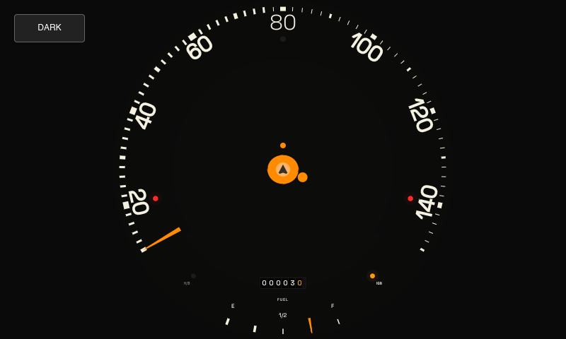

A high-performance car dashboard application built with **Rust** and **Slint**. It features a smooth speedometer and integrated vector maps.




## Introduction
The `car-app` is designed to demonstrate a modern, fluid automotive interface. It leverages Slint's reactive UI framework and Rust's safety and performance to provide a responsive experience, even with complex background tasks like vector map rendering.

### Key Features
- **Dynamic Speedometer**: A beautiful, arch-based speedometer with a simulated needle and scaling labels.
- **Vector Map Integration**: Background-rendered maps using PMTiles and vector tiles, clipped to a circular dashboard view.
- **Adaptive Theme**: Automatically switches between Light and Dark modes based on the time of day, with a manual override for testing.
- **Responsive Design**: The UI scales proportionally to fit various window sizes and aspect ratios.

## Getting Started

### Prerequisites
- **Rust**: Ensure you have the latest stable Rust toolchain installed (edition 2024 is required).
- **C Compiler**: Needed for building some dependencies (e.g., `flate2`).
- **Font Assets**: The app uses "Space Grotesk". Ensure fonts are present in the `assets/` directory.


### Building and Running
The project includes a `justfile` to simplify common development tasks using the [just](https://github.com/casey/just) command runner.

To display all available recipes and descriptions:
```bash
just
```

To build the workspace:
```bash
just build
```

To run the application with the default map:
```bash
just run
```

To run the application with interactive map selection:
```bash
just run-interactive
```

To run the application with a specific map file:
```bash
just run path/to/map.pmtiles
```

To run formatting, linting, or tests:
```bash
just fmt
just lint
just test
```

To build for production with optimizations:
```bash
just build-release
```
## Ubiquitous Language
This project adheres to a shared vocabulary to ensure consistency across the design and code.

### 1. Core Application & Layout
| Term | Definition | Code Reference |
| :--- | :--- | :--- |
| **AppWindow** | The main window component and entry point of the Slint UI. | `AppWindow` (slint) |
| **Display Size** | The minimum of window width/height, defining the circular workspace. | `display_size` |
| **UI Scale** | A scaling factor derived from the reference resolution (960px). | `ui_scale` |
| **Dark Mode** | The high-contrast, dark-themed visual state for night driving. | `is_dark_mode` |
| **Theme Foreground** | The primary color for text and icons based on the current mode. | `theme_foreground` |

### 2. Dashboard & Speedometer
| Term | Definition | Code Reference |
| :--- | :--- | :--- |
| **Speed Arch** | The circular scale used to display speed intervals. | `Path` (loop 71) |
| **Speed Marker (Tick)** | Individual lines on the arch. Thicker lines represent 20mph intervals. | `sw`, `hw` |
| **Needle** | The orange indicator that rotates to point at the current speed. | `Needle` (Path) |
| **Speed Numbers** | The numerical labels (20-140) positioned along the arch. | `Text` (loop 7) |
| **Current Speed** | The integer value representing the vehicle's speed in MPH. | `current_speed` |

### 3. Map Display
| Term | Definition | Code Reference |
| :--- | :--- | :--- |
| **Map Layer** | The background container that holds the rendered map image. | `Rectangle` (clipping) |
| **Map View** | The logical state of the map, including center tile and zoom level. | `MapView` (struct) |
| **Map Asset** | The `assets/map.mbtiles` file containing vector map data. | `PMTiles` |
| **Car Marker** | The visual group representing the car's position on the map. | `Car Marker Glow/Inner` |
| **Car Arrow** | The directional icon indicating the car's heading. | `Car Arrow` (Path) |
| **Tile Cache** | An LRU cache storing pre-processed vector paths for map tiles. | `TILE_CACHE` |
| **Render Request** | A message sent to the background thread to trigger a map redraw. | `RenderRequest` |

### 4. Domain Logic & Simulation
| Term | Definition | Code Reference |
| :--- | :--- | :--- |
| **Night Time Logic** | Logic determining if it is currently night (6 PM to 6 AM). | `is_night_time` |
| **Speed Simulation** | A sine-wave based algorithm to generate varying speed data. | `calculate_simulated_speed` |
| **Map Drag** | The user interaction of moving the map via touch/mouse. | `on_map_dragged` |
| **Theme Toggle** | The manual override to switch between Dark and Light modes. | `toggle_theme` |
